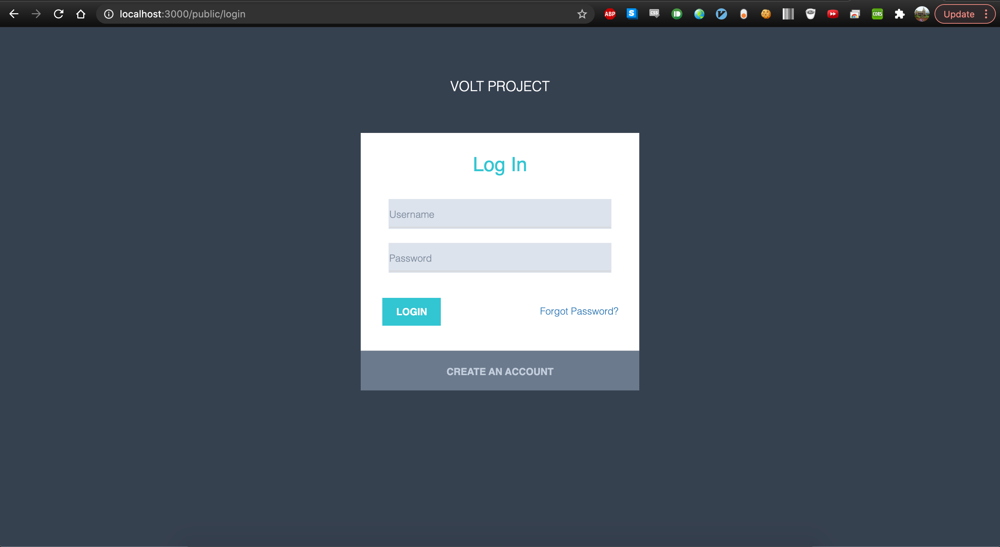
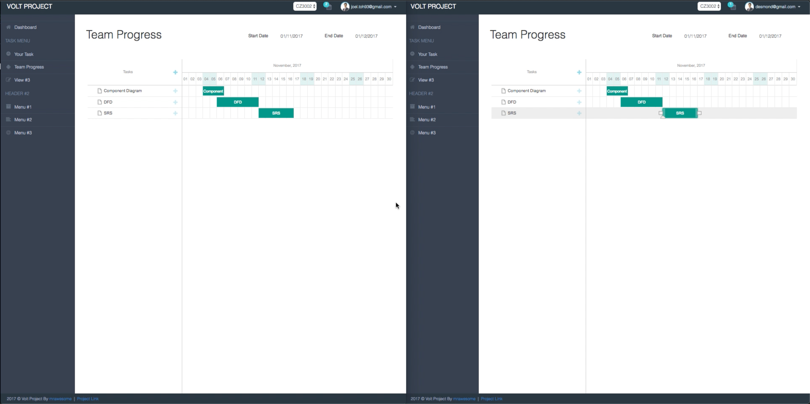
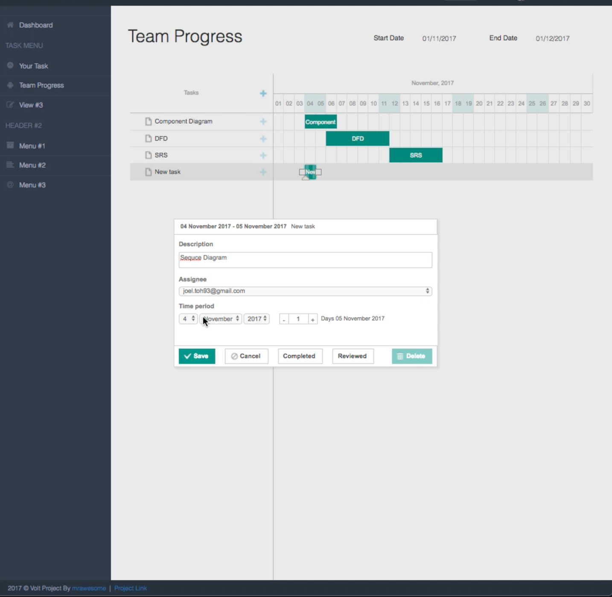
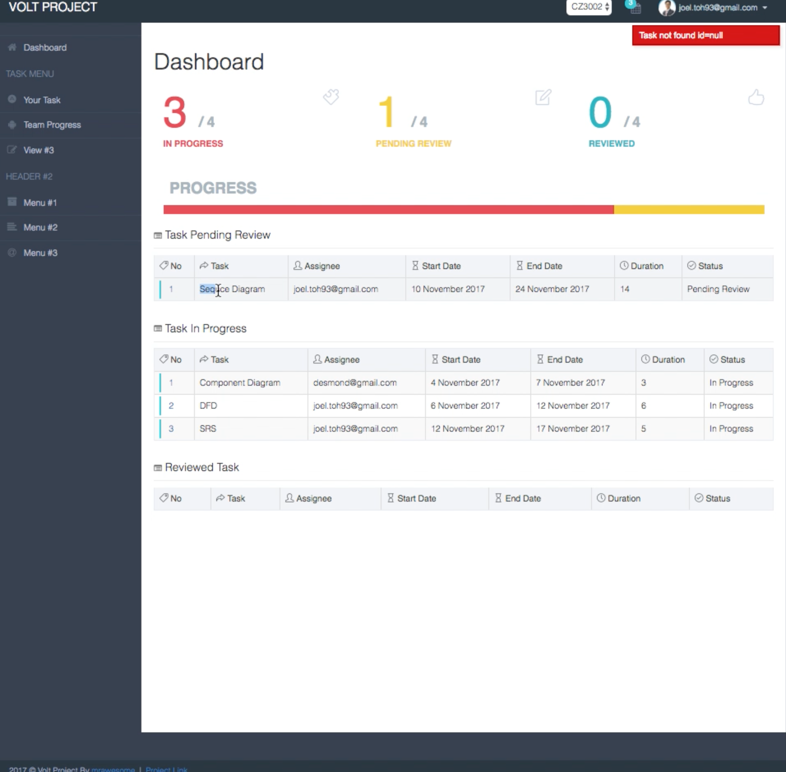
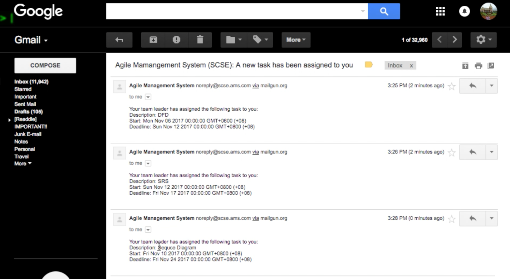

# Agile Task Management System

## Instruction

1. Clone the repository to your local machine
2. Open *cmd/Terminal* and `cd` to the repository path (e.g. `cd /Users/your-username/Projects/CZ3002_Agile_Mgmt_System`)
3. Type `npm install` to install all the `node_modules/` dependencies
4. Type `meteor` to run the application server
5. When the *cmd/Terminal* shows the message
    > => Started proxy.
    > => Started MongoDB.
    > => Started your app.
    > => App running at: http://localhost:3000/

    open [localhost:3000](http://localhost:3000/) to view the application client


# UI

### Login



### Real Time Task Monitoring 1



### Create Tasks



### Task Dashboard



### Email Notifications




## Note
- Please read the `Application Structure` section carefully, since Meteor compiles the application from the way we organize it
- For more specific description of each individual file's functionality, read the documentation at the start of each file
- *Blaze* refers to the HTML renderer, who takes HTML boilerplate code, *Spacebars* embedded variables syntax, and user-defined components/templates to produce the complete HTML page view
- **Single-page website** refers to a web application who effectively update its data representation and interfaces without the need to refresh
- The file `index.js` included in almost every directories serves as the entry point for importing all modules from the enclosing folder (or `import /path` is equivalent to `import /path/index.js`)

## Code Style

- Naming
  - Use **dash-separated** for folder and file names e.g. `app-components/`
  - Use **dash-seperated** for HTML attributes and CSS classes as usual e.g. `nav nav-bar`, `.container`
  - Use **camel case** for template names and variable names e.g. `template name='userNav'`, `notificationItem`
  - Use **upper-camel case** for modular utility functions and constants e.g. `export const UserMenu`
-

## Application Routes

- `public/`: common prefixes for all public routes
  - [`public/register/`](http://localhost:3000/public/register): for admin purpose, register new user with email and
  password
  - [`public/login/`](http://localhost:3000/public/login): as its name suggested, this route is for logging in
- `user/`: common prefixes for all private routes
  - `user/your-task/`: route to view your assigned task
  - `user/team-task/`: route to view overall team task
  - `user/profile/`: route to view and edit personal profile

## Application Structure

- `.meteor/` is where all meteor-related data are stored, it is highly recommended not to touch the folder
- `node_modules/` is where all node modules (installed by `npm`) are stored, also recommended not to touch this folder
- `client/` is where client-side codes are stored and loaded
- `server/` is where server-side codes are stored and loaded
- `private/` is where website private assets are stored, accessed only via *Meteor Assets API*
- `public/` is where website public assets are stored, these assets will be automatically loaded to the client
- `imports/` is where application modules are stored, these modules are to be loaded by either the client code inside `client/` or server code inside `server/`
  - `imports/api/` is where server APIs are defined, which can be anything ranging from DB CRUD operations
  - `imports/startup/` is where the startup code for either client/server are defined, usually for initializing certain properties for the website
    - `imports/startup/client` is where the startup code for only client are stored
    - `imports/startup/server` is where the startup code for only server are stored
    - `imports/startup/both` is where the startup code for both client and server are stored
  - `imports/ui/` is where the UIs are defined, both in terms of HTML views (which is rendered using *Blaze* and *Spacebars*) and JS controllers
    - `imports/ui/layouts` is where the page skeletons (or **master layout**) are defined, although for Meteor it is recommended to develope the application as a **single-page website**
    - `imports/ui/pages` is where different page contents are defined (this can be considered different views in the single-page website context)
    - `imports/ui/components` is where different components (as in *React*, or **templates** as in *Blaze*)
    - `imports/ui/stylesheets` is where the custom stylesheets for the application are stored
  - `import/assets` is where the assets for the *Metronic* theme are stored
- `.gitignore` lists the files or directories that are excluded from syncing with git (currently we're excluding `node_modules/` folders since it's filled with `npm` packages which are redundant to store on GitHub)
- `package.json` describes the project as a node module, with all the dependencies as stored in `node_modules/` (to install these dependencies, simply type `npm install` in either the *Terminal (Mac)* or *PowerShell (Wins)*)

## Permission

- **NOTES**:
  - an user has permission to do certain actions doesn't mean that he/she can do so globally, but rather *subjected to further filtering by their userIds*
  - `admin` permission denotes the role of an admin, used to determine routing between `users` route and `admin` route

- Global (*which all users have permission*)
  - `users.self`: view/edit own's profile data
  - `courses.view`: view course description
  - `groups.view`: view group description
  - `teams.view`: view team description
  - `tasks.view`: view task description
- Users
  - `users.create`: create a new user
  - `users.list`: list all users
  - `users.permission`: view/edit users' permissions
  - `users.delete`: delete an user
- Courses
  - `courses.create`: create a new course
  - `courses.list`: list all courses
  - `courses.edit`: edit course description
  - `courses.delete`: delete a course
- Groups
  - `groups.create`: create a new group
  - `groups.list`: list all groups in a course
  - `groups.edit`: edit group description
  - `groups.delete`: delete a group
- Teams
  - `teams.create`: create a new team
  - `teams.list`: list all teams in a group
  - `teams.edit`: edit team description
  - `teams.delete`: delete a team
- Tasks
  - `tasks.create`: create a new task
  - `tasks.list`: list all tasks in a team
  - `tasks.assign`: assign the task to a team member
  - `tasks.update`: update the progress of the task
  - `tasks.markCompleted`: mark the task as reviewed and completed
  - `tasks.edit`: edit task description
  - `tasks.delete`: delete a task

## Roles

```
export const Permissions = {
  admin: [
    'admin',
    'users.create',
    'users.list',
    'users.read',
    'users.permission',
    'users.delete',
    'courses.create',
    'courses.list',
    'courses.edit',
    'courses.delete',
    'groups.create',
    'groups.list',
    'groups.edit',
    'groups.delete',
    'teams.create',
    'teams.list',
    'teams.edit',
    'teams.delete',
  ],
  coordinator: [
    'courses.edit',
    'groups.list',
    'groups.edit',
    'teams.list',
    'teams.edit',
    'tasks.list',
  ],
  teamLeader: [
    'tasks.create',
    'tasks.list',
    'tasks.assign',
    'tasks.update',
    'tasks.markCompleted',
    'tasks.edit',
    'tasks.delete',
  ],
  teamMember: [
    'tasks.list',
    'tasks.update',
    'tasks.edit'
  ]
}
```

# Disclaimer
This project was done for a school project and for education purposes only and is no longer being maintained. This repository is just used to archive the projects done for school. 

# Project Team Members

* Joel, Vince, Jefferson, Desmond, Chao Jian, Brandon
